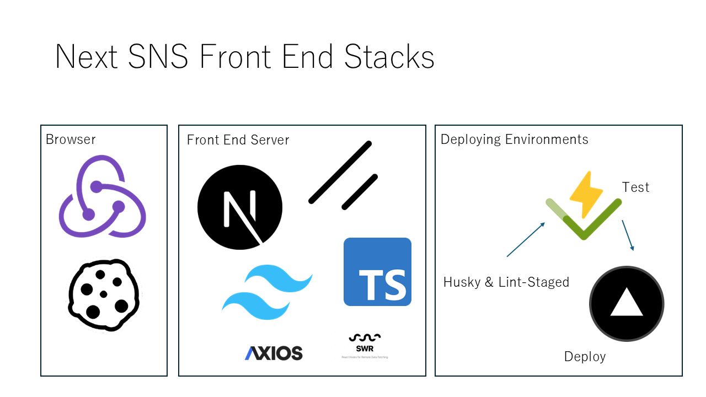
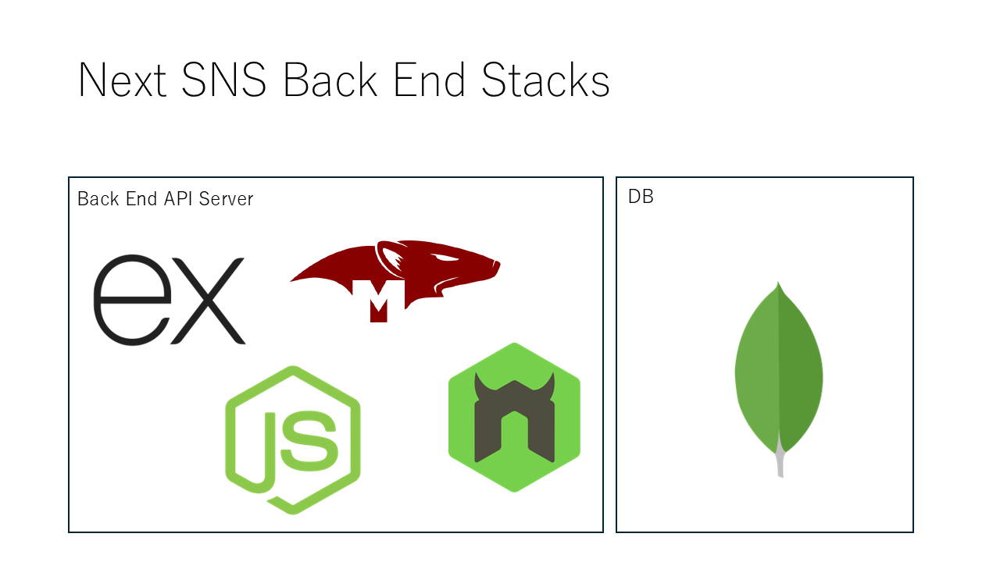

# Next SNS

## 概要

このプロジェクトは、NextJs と NodeJs と MongoDB を使用して作成された SNS クローンアプリケーションです。

[https://nextsns.net](https://nextsns.net)

## DEMO

**TOP**


**Unlogined Timeline**


**Profile**


**User Settings**


## Using Stacks





## Directory Stracture

```sh
/
├── public/         # 静的ファイル
├── src/
│   ├── app/        # Next.jsのApp Router
│   ├── components/
│   ├── constants/  # 定数（APIエンドポイントなど）
│   ├── features/   # 機能単位のモジュール（例: 認証）
│   ├── hooks/      # カスタムフック
│   ├── lib/        # ユーティリティ関数
│   ├── state/      # グローバル状態管理
│   ├── styles/     # CSSやスタイル関連
│   ├── test/       # テストコード（src内に移動も可）
│   └── types/      # TypeScriptの型定義
└── next.config.js  # Next.jsの設定
```
